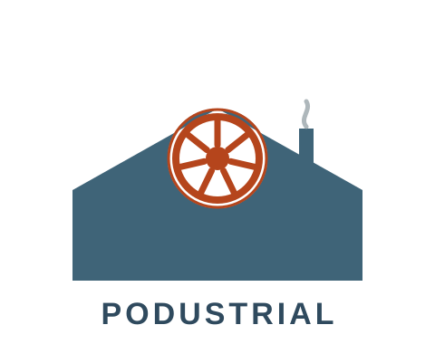

<div align="center">
  

  # Podustrial

  **Kubernetes-Grundkonzepte spielerisch lernen — über eine Fabrik-Metapher.**
</div>

---

Podustrial ist ein browserbasiertes Lernspiel für Menschen ohne Container- oder Kubernetes-Vorwissen. Du baust und betreibst eine Fabrik — im Hintergrund erzeugen deine Aktionen **echte Kubernetes-Objekte** in einem echten lokalen [kind](https://kind.sigs.k8s.io/)-Cluster. Scheduling, Selbstheilung und Ausfälle kommen vom echten K8s-Scheduler/Controller, nicht aus simulierter Spiellogik.

Fachbegriffe wie „Pod" oder „Deployment" erscheinen erst, *nachdem* du die zugehörige Aktion erlebt hast — Erleben vor Benennen.

## Voraussetzungen

- [Docker](https://www.docker.com/products/docker-desktop/)
- [kind](https://kind.sigs.k8s.io/docs/user/quick-start/#installation)
- Go 1.22+ (nur für die Entwicklung)

## Loslegen

```bash
make start
```

Erstellt (falls nötig) einen lokalen kind-Cluster und startet den Server — ein Prozess, ein Port, Frontend eingebettet. Danach im Browser öffnen.

```bash
make stop
```

Löscht den kind-Cluster wieder sauber.

## Entwicklung

```bash
make dev              # Hot-Reload: Frontend-Dev-Server + Go-Backend
make test              # alle Unit-Tests (Go + Frontend)
make test-integration  # Integrationstests gegen einen frischen kind-Test-Cluster
```

Details zu Architektur und Implementierungsplan: [`docs/superpowers/specs/2026-09-01-technische-architektur-design.md`](docs/superpowers/specs/2026-09-01-technische-architektur-design.md).

## Lizenz

[Apache License 2.0](LICENSE)
